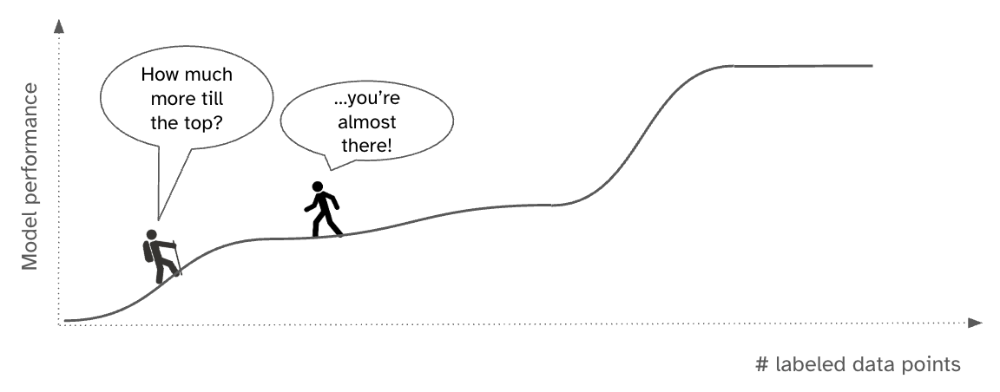
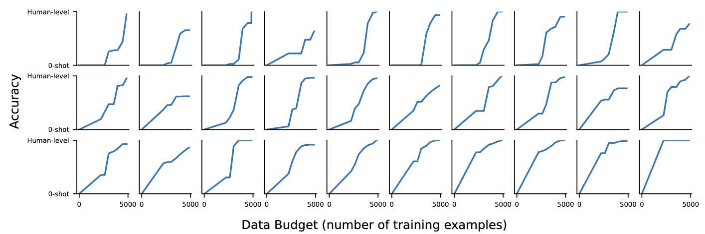
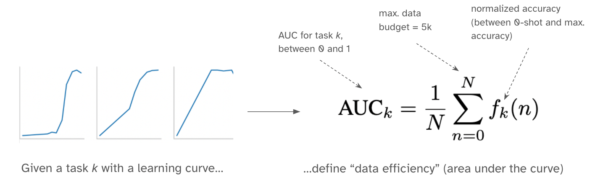
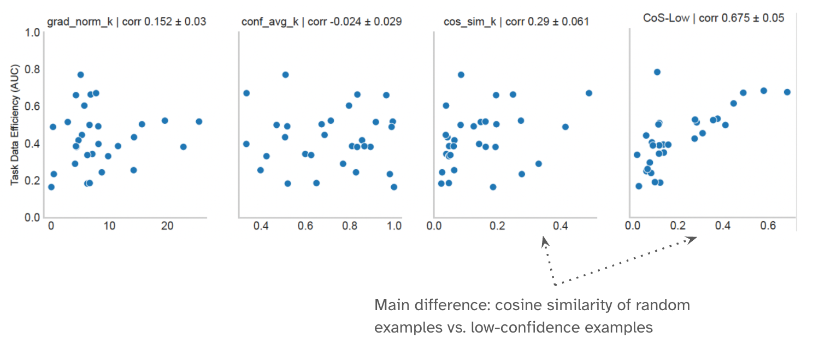
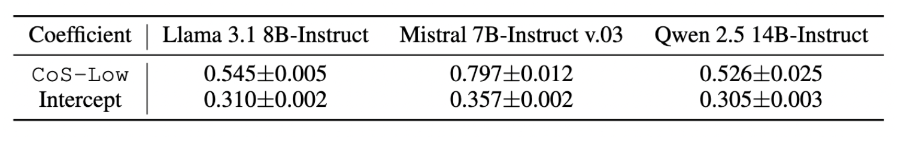

# Efficiently Estimating Data Efficiency for Language Model Fine-tuning

<figure align="center">

<figcaption>The crux of our project.</figcaption>
</figure>

## 1. High-level overview

Different tasks exhibit different **"data efficiency"** --- i.e., some tasks need many more examples to reach the same accuracy level as others. Our goal is to identify a proxy metric that correlates with the task's data requirements, or task "data efficiency". We plot **"data efficiency curves"**, a function that maps fine-tuning data points to a fine-tuned model's performance, across 30 tasks at varying data budgets (50, 100, 200, 500, 1000, 2500, 5000). Some tasks need substantial data to reach maximum saturation (top row, hockey-stick curves), while others need only a handful of examples (bottom row, quick-slope curves).

<figure align="center">

<!-- <figcaption></figcaption> -->
</figure>

To formulate the data efficiency metric that is comparable across tasks, we formally define data efficiency using the area under empirically measured data efficiency curves.

<figure align="center">

<!-- <figcaption>Our formal data efficiency definition.</figcaption> -->
</figure>

Among the metrics we surveyed and tested for capturing task complexity and example difficulty, we find that gradient cosine similarity computed on low-confidence examples (**"CoS-Low"**) is the most predictive of data efficiency (right-most plot). Notably, this relationship holds specifically for low-confidence examples, not random examples.

<figure align="center">

<!-- <figcaption>Correlation of various metrics with data efficiency. The leftmost plot (CoS-Low × Data efficiency) shows the highest correlation.</figcaption> -->
</figure>

Leveraging this near-linear relationship, we fit a linear regression to learn coefficients (c, I) that map CoS-Low to our data efficiency metric, then use these to estimate data efficiency curves:

$$\text{Estimate data efficiency: } \text{AUC}' = c * \text{CoS-Low} + I$$
$$\text{Esimtated data efficiency curve: }\hat{f}(n) = n^p, p = \frac{1-\text{AUC}'}{\text{AUC}'}$$

We tested our method across model families of varying sizes and report the learned coefficients for each. Note that coefficients are model-family specific and not shared across families. However, once learned, these coefficients enable efficient conversion from CoS-Low to data efficiency estimates.

<figure align="center">

<!-- <figcaption>Learned coefficients across model families. Once learned, these coefficients enable efficient conversion from CoS-Low to data efficiency estimates.</figcaption> -->
</figure>


## 2. Code Overview

The repository also contains code for 1. fine-tuning the base model on downstream tasks to produce the data efficiency curves and measure the data efficiency metrics, and 2. computing CoS-Low to predict the data budget requirement. The workflow consists of four main steps:

1. **Model fine-tuning** at varying data budgets
2. **Evaluation** of fine-tuned checkpoints
3. **Data efficiency computation** from the data efficiency curves
4. **Data budget prediction** on an unseen dataset using CoS-Low

---

### 2.a. Fine-tuning at multiple data sizes

We use `finetune_ds.py` to fine-tune models at different data sizes. This script handles model loading, tokenization, and distributed training via FSDP.

**Usage:**

```bash
cd scripts/

accelerate launch --num_processes 2 \
    --config_file $HOME/dataefficiency/ds_configs/fsdp_full_config_h100_2gpu.yaml \
    finetune_ds.py \
    --warmup_ratio 0.1 \
    --step 500 \
    --dataset_name ${dataset} \
    --task ${task} \
    --batch_size 2 \
    --grad_accumulation_step 8 \
    --max_seq_len 2048 \
    --model_name ${model_name} \
    --checkpoint_dir ${model_checkpoint_directory} \
    --lr 1e-5 \
    --data_size ${data_size} \
    --log_and_save_step 4 \
    --use_flash_attention \
    --seed 123
```

---

### 2.b Evaluating Fine-tuned Models

After fine-tuning, we evaluate each checkpoint on a held-out test set using `eval.py`.

**Usage:**
```bash
cd scripts/

python eval.py \
    --dataset_name ${dataset} \
    --task ${subset} \
    --split "test" \
    --model_name ${model_path} \
    --data_size ${data_size} \
    --max_seq_len 2048 \
    --result_path ${HOME}/dataefficiency/results/finetune_results/${model_prefix}_${task_key}_full_result_v2.json \
    --use_safetensor \
    --use_flash_attention
```

Results are saved as JSON files with accuracy metrics.

---

### 2.c Computing AUC

The `calculate_per_task_auc.py` script converts fine-tuning results across different data budgets into a single data efficiency metric (AUC). These AUC values are then used to fit a linear regression mapping CoS-Low to data efficiency. Task AUC values are stored under the folder `results/auc_res/`.

---

### 2.d. Compute CoS-Low value on an unseen dataset.

For a new, unannotated dataset, we compute CoS-Low by 1) identifying low-confidence examples, and 2) sampling and annotating 32 examples among the low-confidence segement to compute CoS-Low. `results/coslow_data/` folder contains a sample data for demo.

**i. Identify low-confidence examples**

```bash
cd utils/
python calculate_coslow.py \
    --model_name "meta-llama/Llama-3.1-8B-Instruct" \
    --model_prefix "llama" \
    --torch_dtype "bfloat16" \
    --data_path "../results/coslow_data/task_data_unannotated.json" \
    --num_rep 1 \
    --confidence_metric "avg_confidence" \
    --batch_size 32 \
    --compute_probability
```
This outputs a file containing the 32 low-confidence examples (`low_conf_examples_to_annotate.json`) that need manual annotation.

**ii. Identify low-confidence examples**

After annotating these 32 examples, compute the gradient cosine similarity:

```bash
cd utils/
python calculate_coslow.py \
    --model_name "meta-llama/Llama-3.1-8B-Instruct" \
    --model_prefix "llama" \
    --torch_dtype "bfloat16" \
    --data_path "../results/coslow_data/low_conf_examples_annotated.json" \
    --compute_coslow
```

**iii. Predict data requiremetn**

Given the CoS-Low value, learned coefficients to map it to data efficiency metric, and the target performance, we can estimate how many fine-tuning data points are required to reach the target performance:

**Example:**
```python
# For a new task with CoS-Low = 0.65, targeting 90% accuracy
coefficients = [0.54, 0.31]
predicted_auc = coefficients[0] * 0.65 + coefficients[1]
pct_budget_required = 0.9 ** (predicted_auc / (1-predicted_auc))
budget_required = 2 ** (pct_budget_required * np.log2(5000))
print(f"Estimated training examples needed: {budget_required}")
```

## Note

### Dataset Access
`prompts/prompts_by_task_modified.yaml` contain queries used for fine-tuning the the base models to produce the data efficiency curves. Note that some datasets in `prompts/prompts_by_task_modified.yaml` reference local file paths for manually curated data. To reproduce our results:

1. Extract the dataset archive: `tar -xzf data.tar.gz`
2. Update file paths in `prompts_by_task_modified.yaml` to point to the extracted JSON files